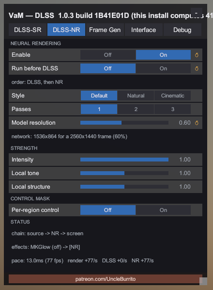

# VaM DLSS – Model Resolution

A companion plugin for [UncleBurrito's VaM DLSS](https://www.patreon.com/UncleBurrito) that adds one
control to its panel: **Model resolution** — how much of the frame, per axis, DLSS Neural Rendering
works at. It is the same idea as *WorkingScale* / "Model resolution" in
[Dagherbou's OptiScaler_DLSSNR](https://github.com/Dagherbou/OptiScaler_DLSSNR), brought to
Virt-A-Mate.

Neural Rendering's cost is per pixel, and at full size it is most of the frame. At 50% the network
sees a quarter of the pixels.

**The frame itself is never reduced.** The network is shown a filtered shrink of the frame, and only
what the network *changed* is enlarged and laid back over the untouched full-size frame. The picture
underneath keeps all of its own detail whatever the slider says; what softens is the network's own
fine structure, which is synthesised small. Its broader work — tone, shading, skin — survives.



## What it buys

Measured in VaM's start scene at 2560x1440 on an RTX 5060 Laptop, Neural Rendering only (no DLSS
upscaling), one pass:

| Model resolution | Network runs at | Frame time | Frames/s |
|---|---|---|---|
| Neural Rendering off | – | 3.2 ms | 308 |
| 100% (VaM DLSS as it ships) | 2560x1440 | 27.8 ms | 36 |
| 75% | 1920x1080 | 22.2 ms | 45 |
| 50% | 1280x720 | 11.3–14.5 ms | 69–88 |
| 25% | 640x360 | 11.4 ms | 88 |

Two things to read off that. The network's own time falls with the square of the slider, as it
should. And there is a floor the slider cannot move: with Neural Rendering on at all, about 8 ms of
every frame here does not depend on the model's size — most likely what it costs VaM DLSS to hand
the frame from VaM's D3D11 device to the D3D12 device the network runs on and back — so below about
50% there is little left to win. Your numbers will differ with the scene and the card; the shape
will not.

## Requirements

- **VaM DLSS 1.0.3** by UncleBurrito, installed and working. It is a paid mod and nothing of it is
  included here. This plugin does nothing without it.
- BepInEx 5 (which VaM DLSS already needs), an RTX card.

## Installing

Unzip the release into your VaM folder, giving you:

```
<VaM>\BepInEx\plugins\VamDlssNrWorkScale\VamDlssNrWorkScale.dll
<VaM>\BepInEx\plugins\VamDlssNrWorkScale\VamDlssNrWorkScaleNative.dll
```

That folder is the whole plugin. No file of VaM's or of VaM DLSS's is touched or replaced. To
uninstall, delete the folder.

## Using it

Press **F10** for VaM DLSS's panel, open the **DLSS-NR** tab. Under *Passes* there is a new row:

- **Model resolution** — 0.25 to 1.00. 1.00 is VaM DLSS exactly as it ships. The change is applied
  when you let go of the slider, because every distinct value rebuilds the network. The line under
  it says what the network is actually running at.

It works the same on the monitor and in a headset, where it is applied per eye. It multiplies with
everything else that decides the network's input size: with *Run before DLSS* on and an upscaling
quality mode selected, it is a fraction of the DLSS render extent. Screenshot cameras (the
screenshot key, thumbnails, SuperShot) use it too, which is where the saving is largest.

Settings live in `BepInEx\config\jeahbwoi720.vamdlssnr.workscale.cfg`:

| Setting | Default | |
|---|---|---|
| `ModelResolution` | 1.0 | the slider |
| `ApplyToScreenshots` | true | off = stills always run the network at full size |
| `Enlargement` | 0 | 0 = matched residual; 1 = classic (the network's small picture simply enlarged — softer, for comparison) |
| `AllowSupersampling` | false | lets the slider go to 2.0: the network runs on an *enlarged* frame. Experimental, expensive |
| `DebugView` | 0 | 2 = show the network's edit on its own; 3 = show the frame with the edit left out |

## How it works

VaM DLSS is not modified. Its own code does all the Neural Rendering work, unchanged — it is simply
handed a smaller frame. Three [Harmony](https://github.com/BepInEx/HarmonyX) hooks do that:

1. **Before** `NrCapture.RunNeuralRendering(w, h, input, …)`: the frame is shrunk into a texture of
   the model's size — an exact area average, in linear light — and the method is given that texture
   and that size instead. It then builds its guides, its view and its evaluate at the size it was
   told, exactly as it does for any other extent.
2. **After** it: the result is resolved back to the frame's size. For every pixel,
   `result = frame + (model output − model input)`, in the sRGB-encoded space the network itself
   reads and writes, with the edit shortened where it would push a colour out of range. This is the
   "matched residual" from Dagherbou's fork (hhkbble's idea): the two pictures being compared are
   the same size, and the only thing that crosses from the small raster is the edit.
3. `NrCapture.Compose` is rewritten to read the resolved frame where it read the network's output.

The two image passes are in a small native DLL and run on Unity's render thread, in command order,
around the evaluate VaM DLSS issues. VaM's D3D11 device is single-threaded, so the managed side
never touches it: it only queues descriptions of work.

If a different build of VaM DLSS lacks anything this reaches for, the plugin says so in
`BepInEx\LogOutput.log`, patches nothing, and VaM DLSS runs as it ships.

## Building

Needs the VS 2022 Build Tools (C++), the Windows SDK, the .NET SDK, and a VaM install with BepInEx 5
and VaM DLSS — the managed half is compiled against VaM's own assemblies.

```
pwsh build.ps1 -VamDir D:\path\to\VaM -Zip     # native + managed -> dist\ and a release zip
pwsh install.ps1 -VamDir D:\path\to\VaM        # copy dist\ into the game
```

## Testing

Three layers, none of which needs the others:

- `native\out\vws_test.exe <dll> [warp] [timing]` — the two passes against a CPU reference on a real
  D3D11 device (or the software rasterizer): the area average, the edit landing at full strength and
  only where it was made, the stereo seam, odd ratios, the device left exactly as it was found.
- `pwsh test\run-hosttest.ps1` — the managed half on VaM's own Mono runtime without Unity: the hooks
  go onto the real `VamDlssNrPlugin.dll`, the rewritten method compiles, the native calls marshal.
- `pwsh test\run-ingame.ps1` — VaM itself, driven through every model resolution with the scene
  frozen and a screenshot per step; `python test\analyze-ingame.py` turns those into numbers. It also
  times the network's answer against its input, frame by frame.

## Credits

- [UncleBurrito](https://www.patreon.com/UncleBurrito) — VaM DLSS, which does all the real work.
- [Dagherbou](https://github.com/Dagherbou/OptiScaler_DLSSNR) and hhkbble — the working-scale and
  matched-residual technique this reimplements for Unity/D3D11.

MIT licensed. Not affiliated with any of the above, nor with NVIDIA or MeshedVR.
