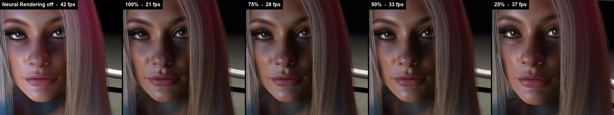
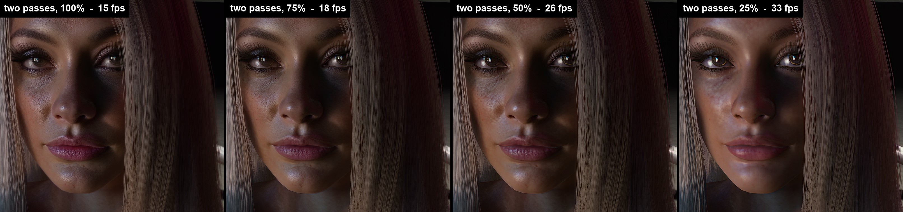
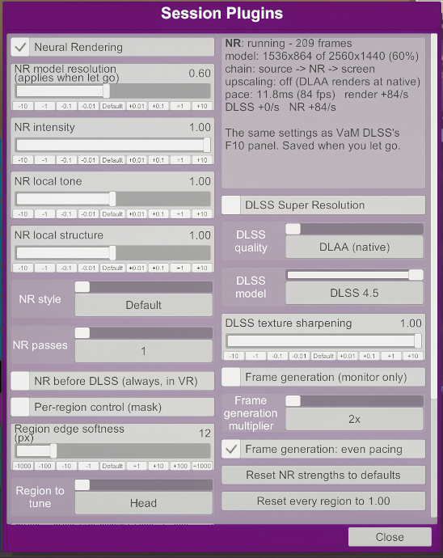

# VaM DLSS Companion

A free companion plugin for UncleBurrito's VaM DLSS in
Virt-A-Mate. VaM DLSS itself is a separate mod and nothing of it is included here; this plugin adds
to it and does nothing without it.

It began as one slider and has grown since:

- **[Model resolution](#model-resolution)** — run DLSS Neural Rendering on a smaller picture, for a
  multiple of the frame rate, without reducing the frame itself
- **[Focus window](#using-it)** — Neural Rendering only where you look: in a headset it follows your
  gaze when there is eye tracking, on a monitor it follows the person in view
- **[In-headset controls](#in-headset-controls)** — VaM DLSS's settings as a session plugin's UI,
  where the controllers reach them
- **[Sharpening](#sharpening)** — a filter over the finished frame
- **[Headset menu at full size](#headset-menu-at-full-size)** — VaM's menu drawn after DLSS and
  Neural Rendering, at the headset's own resolution
- **[Scene UI atoms after DLSS](#scene-ui-atoms-after-dlss)** — a scene's own buttons, sliders and
  texts drawn after DLSS and Neural Rendering too, and still hidden behind whoever stands in front
- **[Passthrough](#passthrough-playstation-vr2)** — your room behind the person, through a
  PlayStation VR2's cameras
- **[Flip-model window and frame pacing](#flip-model-window-and-frame-pacing-monitor)** — on the
  monitor: a window RTX HDR can take, and generated frames spread evenly
- **[Foveated shading](#foveated-shading)** — the scene shaded at full rate only where you look
  (NVIDIA cards)
- **[Hand tracking](#hand-tracking-experimental-playstation-vr2)** — experimental: your hands from
  the headset's cameras, as VaM's own hands, pointing at the menus and pinching to click

What is being worked on and what is planned is on the
[roadmap](https://github.com/users/jeahbwoi720/projects/1). Something wrong or missing: open an
issue.

> This repository was called *VaM-DLSS-Model-Resolution* until October 2026. Old links lead here,
> and the plugin's files, folder and settings file keep their names (`VamDlssNrWorkScale…`), so an
> update installs over what you have.

## Model resolution

**Model resolution** is how much of the frame, per axis, DLSS Neural Rendering works at. It is the
same idea as *WorkingScale* / "Model resolution" in
[Dagherbou's OptiScaler_DLSSNR](https://github.com/Dagherbou/OptiScaler_DLSSNR), brought to
Virt-A-Mate.

Neural Rendering's cost is per pixel, and at full size it is most of the frame. At 50% the network
sees a quarter of the pixels.

**The frame itself is never reduced.** The network is shown a filtered shrink of the frame, and only
what the network *changed* is enlarged and laid back over the untouched full-size frame. The picture
underneath keeps all of its own detail whatever the slider says; what softens is the network's own
fine structure, which is synthesised small. Its broader work — tone, shading, skin — survives.

The options for this are in the in-headset panel, folded away under *Below 100% model resolution:
options* on the Neural Rendering page, and in the plugin's settings file.

**Edit follows edges** (on; costs a little frame rate). Enlarged
plainly, what the network did at its smaller size is a blur: across an edge it runs out on both
sides, in steps a network pixel wide, and inside a surface it is softer than the network made it.
With this on, each full-size pixel takes the edit from the network pixels that were looking at the
same thing it shows, so the edit stays on its own side of every edge, to the pixel. It is then
sharpened by an amount that follows the scale (*edit sharpening*; none at 100%), held within what
the neighbouring network pixels hold so that nothing rings. `[Neural Rendering] EditFollowsEdges`,
`EditEdgeTolerance` (0.08), `EditSharpening` (1.0), `EditSharpeningReach` (0.5).

**Edit kept over frames** (on). The
network is run afresh on every frame and does not answer quite the same twice; at a lower model
resolution each of its pixels is several of the screen's, and the difference shows as a crawl over
skin. With this on, each new frame's edit is blended into the edit kept from the frames before,
which is first carried to where things have moved to by the network's own motion vectors and is not
believed where the new frame says something else. `[Neural Rendering] EditKeptOverFrames`,
`EditNewShare` (0.2: lower is steadier, slower to follow a change of light, and the first to leave a
trail behind somebody moving — go back up if you see one).

**Edit denoise** (0 = off). Run small, the network's grain is coarser, each speck of it several of
the frame's pixels, and can read as noise. This blends the edit towards a blur of itself: tone and
shading stay, speckle goes. It is the opposite of the sharpening and is taken off it, so set *edit
sharpening* to 0 to judge it alone. `[Neural Rendering] EditDenoise`.

**Input sharpening** (0 = off, experimental). Gives the network a slightly sharper shrink of the
frame to work from than the plain average. `[Neural Rendering] InputSharpening`.

**Build detail over frames** (off, experimental). At a half, a third or a quarter each way, the
network's raster is shifted a little every frame and the edit is gathered at the frame's full size,
so that what holds still gains detail finer than the network's own pixels. It costs a full-size pass
and video memory, does little where things move, and can leave a faint trail behind a moving person.
`[Neural Rendering] EditDetailOverFrames`, `EditDetailStrength` (0.6).


## What it buys

Measured in VaM's start scene at 2560x1440 on an RTX 5060 Laptop, Neural Rendering only (no DLSS
upscaling), one pass:

| Model resolution | Network runs at | Frame time | Frames/s |
|---|---|---|---|
| Neural Rendering off | – | 3.2 ms | 309 |
| 100% (VaM DLSS as it ships) | 2560x1440 | 25.2 ms | 39–40 |
| 75% | 1920x1080 | 17.7 ms | 55–57 |
| 50% | 1280x720 | 9.7 ms | 103–104 |
| 25% | 640x360 | 6.1 ms | 157–169 |

What Neural Rendering adds to the frame falls with the square of the slider, as it should: 22 ms at
full size, about 6.5 at 50%, about 3 at 25%. A millisecond or two of it does not shrink with the
model, so the last steps of the slider buy less than the first.

Those are free-running numbers. Where the frame is held to the display — and in a headset it
always is — the frame rate moves in steps instead: an earlier run of the same test, synchronised to
a 180 Hz monitor, gave 36, 45, 90 and 90 frames/s for 100%, 75%, 50% and 25%. There the question
is only whether the whole frame fits the next step, and the slider is how you make it fit. Your
numbers will differ with the scene, the card and VaM DLSS's other settings; the shape will not.

## What it looks like

One scene at 2560x1440 on the same RTX 5060 Laptop: DLAA, then Neural Rendering. The face is cut
out of each screenshot at the screenshot's own pixel size, so open the pictures to judge them.



With two passes of the network (these, and the 25% above, are from a step closer):



Frames a second in that scene, as the overlay in the screenshots shows them. Each number opens the
whole screenshot, with the settings panel in it:

| | Off | 100% | 75% | 50% | 25% |
|---|---|---|---|---|---|
| One pass | [42](docs/examples/nr-off.jpg) | [21](docs/examples/nr-100.jpg) | [28](docs/examples/nr-75.jpg) | [33](docs/examples/nr-50.jpg) | [37](docs/examples/nr-25.jpg) |
| Two passes | – | [15](docs/examples/nr-2pass-100.jpg) | [18](docs/examples/nr-2pass-75.jpg) | [26](docs/examples/nr-2pass-50.jpg) | [33](docs/examples/nr-2pass-25.jpg) |

What the network does to skin and light is there at every setting. Its finest grain — pores,
freckles — thins out as the slider comes down, and two passes at 50% cost less than one at 100%.

## Requirements

- **VaM DLSS 1.0.3** by UncleBurrito, installed and working. It is a separate mod and nothing of it
  is included here. This plugin does nothing without it.
- BepInEx 5 (which VaM DLSS already needs), an RTX card.

## Installing

Unzip the release into your VaM folder, giving you:

```
<VaM>\BepInEx\plugins\VamDlssNrWorkScale\VamDlssNrWorkScale.dll
<VaM>\BepInEx\plugins\VamDlssNrWorkScale\VamDlssNrWorkScaleNative.dll
<VaM>\BepInEx\plugins\VamDlssNrWorkScale\onnxruntime.dll, hand-palm.onnx, hand-points.onnx
<VaM>\BepInEx\patchers\VamDlssNrWorkScale.Early.dll
<VaM>\AddonPackages\jeahbwoi720.VaMVrNrControl.2.var
```

The folder is the plugin. `onnxruntime.dll` and the two `.onnx` models are only loaded when
[hand tracking](#hand-tracking-experimental-playstation-vr2) is switched on (they are other
people's work: see `THIRD-PARTY.md`). The file in `patchers` is what makes the
[flip-model window](#flip-model-window-and-frame-pacing-monitor); without it everything else works.
The `.var` is the session script for the [in-headset panel](#in-headset-controls) and can be left
out if you only use the monitor's panel. No file of VaM's or of VaM DLSS's is touched or replaced.
To uninstall, delete the folder, the file in `patchers` and the package.

## Using it

Press **F10** for VaM DLSS's panel, open the **DLSS-NR** tab. Under *Passes* there is a new row:

- **Model resolution** — 0.25 to 1.00. 1.00 is VaM DLSS exactly as it ships. The change is applied
  when you let go of the slider, because every distinct value rebuilds the network. The line under
  it says what the network is actually running at.

It works the same on the monitor and in a headset, where it is applied per eye (and where the
[in-headset panel](#in-headset-controls) has the same slider). It multiplies with
everything else that decides the network's input size: with *Run before DLSS* on and an upscaling
quality mode selected, it is a fraction of the DLSS render extent. Screenshot cameras (the
screenshot key, thumbnails, SuperShot) use it too, which is where the saving is largest.

- **Focus window** — 0.25 to 1.00, for a headset. 1.00 is the whole view. Below that, Neural
  Rendering works only on a window around each eye's lens centre — where a headset is sharpest and
  where one mostly looks — and does nothing to the rest: at 0.50 that is the middle half of the
  width and height, a quarter of the pixels, so about a quarter of the network's time *with its full
  detail where you look*. Model resolution still applies inside the window, and the two multiply.

  What it costs is at the edge. Neural Rendering changes tone and shading as well as detail, so the
  window is a change of look and not only of sharpness; its work fades out towards the edge (a
  rounded square, `EdgeSoftness`) so that there is no border, but outside it the picture is VaM's
  own. Whether that is a good trade is for your eyes in your headset.

  **With eye tracking the window follows your gaze.** On a headset whose eye tracking reaches
  SteamVR — PlayStation VR2 with [PSVR2Toolkit](https://github.com/BnuuySolutions/PSVR2Toolkit), a
  Bigscreen Beyond 2e, and so on — the window is aimed where each eye is looking rather than at the
  lens centre. The gaze is asked of SteamVR itself (`GetEyeTrackedFoveationCenter`, the call other
  foveated-rendering tools use), so there is nothing else to install. The window does not chase
  every sample: it stays put while the gaze is within a few degrees of its centre (`GazeDeadZone`),
  holds through a blink (`GazeHoldSeconds`), and goes back to the lens centre if the tracker stays
  silent. When it moves, the network's motion vectors are told by how much, so its history moves
  with it. Without eye tracking nothing changes, and the status line says why.

  **The monitor has a window of its own** (off until *Focus window on the monitor* is set). A
  screen is wide and a figure is tall, so it has a width and a height rather than one size — by
  default an upright 45% × 90% of the screen, about two fifths of the pixels. And since nobody
  tells a monitor where the eye is, it is aimed at what the eye is on: **the person in view**. The
  window is centred on the figure when the figure fits it, and on head and chest when it does not;
  with several people it takes the one nearest the middle and stays with them; it glides after
  the figure rather than jumping, and goes back to the middle when nobody is in view.

  It can also **fit the people in view** (*Monitor window fits the people*, on by default once the
  monitor's window is on): the window grows, shrinks and moves so that everyone is inside it, and
  takes whichever of three shapes — upright, square, wide — holds them in the least space. The
  network's cost does not change with any of it, because the network's raster is not the window:
  it keeps the size the settings give it (the *area* of `MonitorWidth` × `MonitorHeight` of the
  screen) and the window is drawn into it at whatever scale that takes. A small figure gets the
  network's pixels one for one; a figure that fills the screen gets them spread thinner, and the
  status line says how thin. Growing, shrinking and moving are free. A change of *shape* rebuilds
  the network — a fifth of a second's hitch — so a shape is kept for a couple of seconds at least,
  and left only for one that is clearly better.

Settings live in `BepInEx\config\jeahbwoi720.vamdlssnr.workscale.cfg` (1.0.0's settings file is
renamed to that on the first start):

| Setting | Default | |
|---|---|---|
| `ModelResolution` | 1.0 | the slider |
| `ApplyToScreenshots` | true | off = stills always run the network at full size |
| `Enlargement` | 0 | 0 = matched residual; 1 = classic (the network's small picture simply enlarged — softer, for comparison) |
| `AllowSupersampling` | false | lets the slider go to 2.0: the network runs on an *enlarged* frame. Experimental, expensive |
| `DebugView` | 0 | 2 = show the network's edit on its own (a focus window shows as the patch it is); 3 = show the frame with the edit left out |
| `[Focus window] Size` | 1.0 | the headset's focus window; 1.0 = off |
| `[Focus window] EdgeSoftness` | 0.35 | how far in from the window's edge the fade runs, as a fraction of its half-size |
| `[Focus window] OffsetX`, `OffsetY` | 0 | nudge the window from the lens centre: towards the nose, and up |
| `[Focus window] OnMonitor` | false | use a focus window on the monitor too |
| `[Focus window] ShowOutline` | false | for testing: draw the window into the picture, its edge in magenta and in cyan the line inside which the network's work lands whole |
| `[Focus window] MonitorWidth`, `MonitorHeight` | 0.45, 0.9 | the monitor window's share of the screen's width and height |
| `[Focus window] MonitorFollowPerson` | true | aim the monitor's window at the person in view rather than the middle of the screen |
| `[Focus window] MonitorDeadZone` | 0.04 | how far the figure may move before the monitor's window starts after it |
| `[Focus window] MonitorFitPeople` | true | size and shape the monitor's window to hold everyone in view, at a fixed cost (`MonitorWidth` × `MonitorHeight` is then the network's area, not a window size) |
| `[Focus window] FollowGaze` | true | aim the window where you look, when SteamVR has eye tracking for the headset |
| `[Focus window] GazeDeadZone` | 0.03 | how far the gaze may wander from the window's centre before the window moves (fraction of the eye; 0.03 ≈ 3°) |
| `[Focus window] GazeHoldSeconds`, `GazeReturnSeconds` | 0.4, 0.3 | how long the window waits when the eye is lost (a blink), and how long it takes back to the lens centre |
| `[Picture] Sharpening` | 0 | the [sharpening filter](#sharpening); 0 = off |
| `[Interface] FullSizeInHeadset` | false | draw [VaM's menu at full size](#headset-menu-at-full-size) in a headset |
| `[SceneUi] …` | | see [Scene UI atoms after DLSS](#scene-ui-atoms-after-dlss) |
| `[Passthrough] …` | | see [Passthrough](#passthrough-playstation-vr2) |

## Sharpening

*Sharpening* (0 to 1, off at 0) is a filter over the finished frame, after DLSS and Neural Rendering
have done their work, on the monitor and in a headset. It is what one expects of a "DLSS
sharpening" slider. VaM DLSS's own *texture sharpening* is something else — it biases textures
towards their sharper mips while DLSS upscales and does nothing at DLAA — so the in-headset panel
now calls that one *DLSS texture detail*.

## Headset menu at full size

In a headset VaM's menu floats in the scene, so with DLSS upscaling it is rendered small and
enlarged with everything else, and Neural Rendering works on it too. With *Headset menu at full
size* on, the menu is left out of the scene's frame and drawn afterwards, at the headset's full
resolution, over the finished picture: DLSS, Neural Rendering and the sharpening filter never see
it. Off by default. Used on a PlayStation VR2; not yet tried on other headsets.

It is drawn over the picture, so a figure standing between you and the menu no longer hides it.

Some scene plugins give the menu to a camera of their own, drawn after the scene (MacGruber's
PostMagic does, to keep its image effects off the menu). With DLSS upscaling in a headset that
camera's picture never reaches the headset and the menu was simply gone; the plugin now draws the
menu onto DLSS's picture in that case, whether this switch is on or off.

## Headset picture size, kept right

VaM DLSS measures the size of the headset's picture once and reconstructs to it for the rest of
the session. Started with a DLSS upscaling mode already on, VaM can still have eye textures of half
the size at that moment, and the headset then gets a coarse, pixelated picture whatever is chosen
afterwards; and after a change of quality VaM DLSS has been seen to take its own reduced eye scale
for yours, so that Ultra Performance renders at a ninth of the size instead of a third. Until now
only moving VaM's own *Render Scale* slider, or a restart, put either right.

The plugin now checks both, on SteamVR headsets: the measured size against the size SteamVR gives
for an eye (written anew only where the eye texture Unity has agrees with SteamVR), and the eye
scale against VaM's Render Scale. Each correction is said in `BepInEx\LogOutput.log`, and so is
every change of these numbers (lines beginning `eye size:`), which is what to send along if a
session comes out pixelated all the same. `[Headset] CorrectEyeSize` and `EyeSizeLog` in the
plugin's settings turn the two off.

A third way to the same coarse picture needed no DLSS mode at all, and showed after loading a
scene: VaM's SteamVR plugin halves the eye scale whenever SteamVR takes the input focus away (for
its dashboard, and during every scene load and long freeze) and gives back what it kept when the
focus returns -- which, told twice that the focus was gone, is its own half. The headset then
stayed at half size until the Render Scale slider was moved. The plugin now leaves the eye scale
alone while SteamVR has the focus, which also spares the half second it took to make every picture
anew at each of these halvings. `[Headset] KeepSizeWithoutFocus = false` has it halved as before,
but given back as it was. Lines beginning `eye size: SteamVR` in the log say each time.

## Logs: what is written to disk

VaM DLSS and this plugin write a few thousand lines a session between them, and VaM DLSS has no
setting that stops its own. Each place they go has a switch -- the *Logs* page of the in-headset
panel, or `[Logs]` in the plugin's settings. All are on as they come: the logs are what says how a
session went wrong, so switch them off for playing and back on for a report.

| Setting | What it stops |
|---|---|
| `ThisPlugin` | this plugin's lines in `BepInEx\LogOutput.log` and Unity's `output_log.txt` |
| `VamDlss` | VaM DLSS's lines in the same two files |
| `VamDlssMotionFile` | `BepInEx\plugins\VamDlssNr\vr_motion.log` |
| `VamDlssNativeFiles` | `ngx\vdn.log` and `ngx\vdn_fg.log` in VaM DLSS's folder |
| `NvidiaFiles` | `ngx\nvngx.log` and `ngx\nvngx_dlss_*.log`, written by NVIDIA's DLSS libraries |

Errors are written whatever the first two say, and so is what the profiler was asked for by its
button. The BepInEx console, where it is open, shows everything either way; other plugins' lines
are not touched (BepInEx's own `[Logging.Disk] Enabled` in `BepInEx\config\BepInEx.cfg` stops the
whole file).

None of this changes a file of VaM DLSS's. Its lines are let fall where BepInEx hands them to its
file writers; its write of `vr_motion.log` is skipped; and the native files are stopped in memory,
where the five libraries that write them (VaM DLSS's and NVIDIA's) call Windows to write: a write
to one of those files is answered as done and not made, every other write goes through as it came.
The files themselves stay, empty. Nothing is hooked until one of the last two is switched off.

## Scene UI atoms after DLSS

The atoms a scene's own interface is built with — UIButton, UIButtonImage, UISlider, UIToggle,
UIText, UIImage — are not on VaM's interface layer but in the scene itself. So neither VaM DLSS (on
the monitor) nor *Headset menu at full size* keeps them out of the frame: their text is rendered
small by a DLSS quality mode, enlarged, and reworked by Neural Rendering with everything around it.

With *Scene UI atoms: after DLSS / NR* on, they are left out of the scene's frame and drawn
afterwards onto the finished picture, at its full resolution — in a headset and on the monitor,
while VaM DLSS is at work. Off by default.

In a headset where a plugin draws VaM's menu with a camera of its own after the scene's (PostMagic
does), the atoms stay in the scene: taken out and drawn at the frame's end, they were not in the
picture the headset is given. There they go through DLSS and Neural Rendering as without this
option, and the status box says so.

Unlike the menu, a button on a wall has to stay behind a person standing in front of it. The
scene's depth is kept and laid under the atoms before they are drawn, so they are hidden as in
plain VaM. With a DLSS quality mode that depth is as coarse as the scene was rendered, and the edge
where something covers an atom follows it.

How it is done: their canvases are moved to a layer VaM does not use (19), which every camera of
the game's draws like the scene's own, so mirrors and screenshots show them as before.

| Setting | Default | |
|---|---|---|
| `[SceneUi] AfterDlss` | false | the switch |
| `[SceneUi] HiddenBehindPeople` | true | lay the scene's depth under them; off: always on top |
| `[SceneUi] Atoms` | the six above | the kinds of atom, by VaM's names, separated by commas |
| `[SceneUi] Layer` | 19 | the layer they are moved to; one of VaM's unused ones: 3, 6, 7, 18, 19 |
| `[SceneUi] DepthSlack` | 0.01 | how far back the scene's depth is pushed (fraction of its distance); raise it if a panel lying on a surface is cut into stripes |
| `[SceneUi] DepthUpsideDown` | false | turn on if they are hidden by things above or below them instead of in front |

## Passthrough (PlayStation VR2)

*Passthrough (headset)* shows your room, through the headset's cameras, wherever the scene has a
**key colour** — green, blue, magenta, black, white, or one you mix. Give the scene a flat
background of that colour and the person stands in your room.

- The room is its own SteamVR overlay, redrawn for every camera frame — 60 a second on a
  PlayStation VR2 — whatever the game's frame rate is. The cut-out around the person comes from the
  game's frame and is fitted to where your head has moved since.
- It works with Neural Rendering and DLSS off, too.
- It works in every DLSS mode. (Up to 1.8 the room stuttered or froze in any mode below DLAA, and
  now and then otherwise until passthrough was switched off and on: its pictures went to SteamVR in
  a way that collided with the game's own. They go another way now, and if its graphics device is
  lost all the same, another is made by itself; the status box counts how often.)
- The PlayStation VR2's cameras are black-and-white, and so is the room -- unless you give it a
  *Room look*: night-vision green, amber, cold blue, sepia, a ramp of heat, or a colour of your
  own, with grain and a dark rim if you like. These cost nothing.
- *Room look: colours guessed by a network* (experimental) is a guess at the room's real colours.
  A network made for colouring black-and-white photographs
  ([DDColor](https://github.com/piddnad/DDColor), its smallest variant) looks at a small copy of
  the left camera's picture about three times a second, on two of the processor's threads, and
  its colours are laid under the camera's own brightness. Expect skin, wood and daylight to come
  out about right and much else not: the cameras see infrared as well as light, and the network
  changes its mind. The colours lag a turning head by a moment, and things nearer than the
  passthrough's distance get theirs a little to the side in the right eye. It needs `colour.onnx`
  beside the plugin, which the download does not carry (270 MB): see Building.
- *Tolerance* and *edge softness* decide how much counts as the key colour. *Passthrough view* can
  show the cut-out on its own, which is the quickest way to set them. With black as the key, keep
  the tolerance low (0.02), or dark hair and shadows go with it.
- With *Headset menu at full size* on, the menu stays in front of the room.
- *Passthrough depth (experimental)*: the plugin works out how far away the room is from the two
  cameras, and lets whatever in it is nearer than the figure show in front of the figure -- a hand
  held out before it covers it. Rough at the edges, and it costs some frame rate.

It needs the headset's cameras to reach SteamVR. On a PlayStation VR2 that takes
[PSVR2Toolkit](https://github.com/BnuuySolutions/PSVR2Toolkit) **1.0.0-experimental** or later. The
status box in the in-headset panel says what was found, and *Probe headset camera (to log)* writes
the details to BepInEx's log. Another headset with two cameras that SteamVR hands out side by side
may work, but the lens model was measured on a PlayStation VR2 and nothing else has been tried.

| `[Passthrough]` setting | Default | |
|---|---|---|
| `Enabled` | false | the switch |
| `Mode` | 0 | 0 = its own overlay, at the camera's pace; 1 = drawn into the game's frame, at the game's pace |
| `KeyPreset` | 1 | 0 custom (`KeyRed`, `KeyGreen`, `KeyBlue`), 1 green, 2 blue, 3 magenta, 4 black, 5 white |
| `Tolerance`, `EdgeSoftness` | 0.3, 0.15 | how far from the key colour still counts, and how soft the edge is |
| `OverlayDistance` | 10 | how far away the overlay stands, in metres; close, the cut-out opens on one side while the head moves |
| `OverlayRoomBehind` | true | also draw the room into the game's frame, under the overlay, so that a gap beside the person shows room and not the key colour |
| `Distance` | 1.5 | the distance at which the room lines up with where things really are |
| `Brightness` | 1 | camera brightness |
| `Look` | 0 | what the room is shown in: 0 the cameras' grey, 1 night vision, 2 amber, 3 cold blue, 4 sepia, 5 heat, 6 your colour (`LookRed`, `LookGreen`, `LookBlue`), 7 colours guessed by a network |
| `LookGrain`, `LookDarkRim` | 0, 0 | grain over the room, and how much darker it gets towards the rim of the view (every look but 0) |
| `LookColourStrength` | 1 | look 7: how strongly the guessed colours are shown; lower hides its mistakes |
| `LensFocal` | 382.6 | the room's apparent size; raise it if the room looks too small |
| `FollowHead` | false | mode 1: carry the camera's picture to where the head is now. Not tried since its last fix |
| `View` | 0 | 1 = the cut-out alone, 2 = the camera everywhere |
| `OverlayOtherShape`, `CutOutPose`, `CutOutTimingMs` | false, 0, 0 | for troubleshooting an overlay that sits wrong |
| `OverlayHandOver` | 0 | mode 0: how the room's pictures reach SteamVR. 0 by their shared handles; 1 as textures SteamVR's library copies, as it was up to 1.8 -- only if the room does not show with 0 |
| `Depth` | false | experimental: things in the room that are nearer than the figure show in front of it |
| `DepthMargin`, `DepthSoftness` | 0.25, 0.1 | how much nearer a thing must be to show in front (as a difference of one over the distance), and over how much more it fades in |
| `DepthUpsideDown` | false | for troubleshooting: take the scene's depth the other way up |

## Flip-model window and frame pacing (monitor)

Unity 2018 presents VaM's window the old way: every frame is copied to the desktop compositor.
Anything that needs a flip-model window cannot take it — NVIDIA's **RTX HDR**, for one. With
*Monitor: flip-model window* on (it is off until you switch it on), the window is made flip-model
when VaM starts in monitor mode (`-vrmode None`). To the game nothing changes: it still draws into a back buffer of the
kind it asked for, and that is copied onto the real one at every present. In a headset nothing is
done.

- It is set up before VaM creates its window, by the file in `BepInEx\patchers`, so the switch takes
  effect at the next start. The status box says `window: flip model, 2560x1440` when it is at work.
- VaM's own anti-aliasing has to be off (a flip-model window cannot be multisampled; with DLSS on it
  is off anyway). With it on, the window is left as it was and the status box says so.
- RTX HDR itself is switched on in NVIDIA's app for VaM, with Windows HDR on.

**Frame generation.** VaM DLSS's frame generation needs what its own README says: VaM's *Desktop
VSync* on (or a frame cap below the screen's refresh rate), a rendered rate below the refresh rate
divided by the multiplier — and DLSS Super Resolution on. With the flip-model window there is also
*Frame generation: paced by queue* (on by default, and only at work while frame generation is on):
every frame is told how many screen refreshes to stay up, so that a burst of generated frames waits
in the window's queue and comes out in rhythm while the game renders the next real frame. Switch VaM
DLSS's own *space frames evenly* off with it. It adds up to about one rendered frame of delay.

| `[Presentation]` setting | Default | |
|---|---|---|
| `FlipModel` | false | the flip-model window, in monitor mode; read when VaM starts |
| `FramePacing` | true | generated frames spread by the window's queue (only with the flip-model window and frame generation on) |

## Foveated shading

*Foveated shading (NVIDIA)* shades the scene at full rate only where the eyes look, and more
coarsely around that — variable rate shading, on a GTX 16 / RTX 20 series card or later. Edges and
depth stay at full resolution; only the shading inside surfaces gets coarser. With eye tracking that
reaches SteamVR it follows the gaze, otherwise it is centred on each lens.

**Known limit:** in a headset it takes effect at DLAA and with DLSS off. With a DLSS upscaling
mode (Quality, Balanced, Performance ...) it currently has no visible effect; that is on the
roadmap. The status box says what it measures: `N% fewer pixels shaded (measured)`, or that there
is no effect.

It applies to the scene camera's own geometry: shadows, image effects, DLSS, Neural Rendering and
the menu are untouched. It saves the graphics card's time, not the processor's — where VaM is held
back by its main thread, as it often is, the frame rate stays where it was, and what is saved can go
into a higher render scale instead.

| `[Foveation]` setting | Default | |
|---|---|---|
| `Enabled` | false | the switch |
| `FollowGaze` | true | aim it where the eyes look, when SteamVR has eye tracking |
| `Inner`, `Outer` | 0.22, 0.42 | full rate within `Inner` of where the eye looks (a share of the picture's height), coarsest beyond `Outer` |
| `Strong` | true | beyond `Outer`, as coarse as the picture's anti-aliasing allows |
| `ShowZones` | false | for setting it up: beyond `Outer` the scene is not shaded at all |
| `UpsideDown` | false | turn on if the zone moves down when the eyes look up |
| `OnMonitor` | false | also in monitor mode, around the middle of the window |

## DLSS on a window (experimental, headset at DLAA)

Foveated shading makes the scene's own shading cheaper. With DLSS on -- DLAA above all -- the larger
cost in a headset is DLSS itself, and that goes by the number of pixels it reconstructs. *DLSS
window* (Foveation page of the panel, or `[DLSS window]`) has DLSS work on a window around the
middle of each eye instead of on the whole eye: at a size of 0.5 that is a quarter of the pixels.
Outside the window the scene is shown as it was rendered.

It is a first version, to see what it buys:

- a headset at DLAA only -- in a DLSS upscaling mode it switches itself off, and the status box
  says so
- outside the window nothing is anti-aliased, and the picture trembles there by the fraction of a
  pixel DLSS has the camera shaken by
- the window's edge is a hard one
- a window that follows the gaze moves in steps, and DLSS starts its history anew at each: a moment
  of rougher picture every time

| `[DLSS window]` setting | Default | |
|---|---|---|
| `Enabled` | false | the switch |
| `Size` | 0.5 | the window's width and height as a share of the eye's |
| `FollowGaze` | false | put it where the eye looks instead of at the lens centre, when SteamVR has eye tracking |

## Where a frame's time goes

*Profile the main thread (to the log)* on the DLSS page of the panel times a scene for half a
minute (`[Profile] Seconds`) and writes what it finds to `BepInEx\LogOutput.log`, in lines
beginning `profile:` -- the frame's phases, every script by name (VaM's own and the scene's
plugins), and the graphics card's time split by what it was spent on. With `Trials` on it then
tries the scene with one thing changed for five seconds each -- at most one physics step a frame,
the physics solver's iterations halved, the menu pointers at rest -- with an unchanged stretch
before and after each, says what each comes to, and puts everything back. Nothing is measured, and
nothing costs anything, outside a run.

It is a way of finding out what holds a scene back before changing settings at a guess. In the
heavy scene it was written for, three quarters of a frame was Unity's physics step, which nothing
in this plugin or in VaM DLSS changes.

One thing it found has a switch of its own: every frame VaM asks, for each controller and for the
mouse, what it points at, and goes through every menu of the scene for each -- 1.5 to 3 ms of a
frame there. *Menu pointers: rest while not on a menu* (DLSS page, `[Menu pointers] RestOffMenus`,
off) asks a pointer that is not on a menu on one frame in four, and every frame again from the
moment it is on one; never while it holds something, while a text field has the keyboard or while
the mouse moves. The pointer's dot may appear up to three frames late as it comes onto a menu. It
saves that time; in the scene it was measured in, that alone was not enough to reach the headset's
next step of frame rate.

## Hand tracking (experimental, PlayStation VR2)

Your hands, found in the pictures of the headset's two cameras. Like passthrough it needs the
cameras to reach SteamVR ([PSVR2Toolkit](https://github.com/BnuuySolutions/PSVR2Toolkit)
1.0.0-experimental or later). It runs on the processor, on a thread of its own, with
[ONNX Runtime](https://github.com/microsoft/onnxruntime) and MediaPipe's two hand models, which come
with the plugin.

**A better model for a headset's cameras (optional).** MediaPipe's models were made for colour
pictures from a phone or a webcam, and on the headset's wide, dark, monochrome pictures they turn a
hand over or lose it. *Hand tracking: Mercury model* follows a hand, once found, with the keypoint
network of Mercury, [Monado](https://monado.freedesktop.org/)'s hand tracking, which
was made for exactly these cameras; on the development machine it is plainly steadier. Its model
file states no licence, so the release does not carry it: download `grayscale_keypoint_jan18.onnx`
from Monado's [hand-tracking-models](https://gitlab.freedesktop.org/monado/utilities/hand-tracking-models),
name it `hand-mercury.onnx`, put it in `BepInEx\plugins\VamDlssNrWorkScale\`, switch the option on
and restart VaM. Without the file the option does nothing.

- *Hand tracking: show skeleton* draws what it sees: the 21 points of each hand.
- *VaM's hands follow* — **Controllers**: the tracked hands are only shown. **Auto**: a controller
  that is being moved or squeezed has its hand; a hand the cameras see, whose controller lies still,
  follows the cameras. **Tracked hands**: the cameras have every hand they see. VaM's own hand
  models are driven (through VaM's Leap Motion path), so they touch and push what the controllers'
  hands do.
- *Point and pinch menus* — **not working yet.** The idea: a line from the hand points at VaM's
  menus, a pinch of thumb and index clicks and drags, and the left palm turned to your face with a
  pinch opens or closes the menu. It is in the build, off unless switched on, and does not do its
  job at present.

This is the roughest part of the plugin, and experimental throughout. Finger poses are approximate
— a fist and single raised fingers are the weak spots — a hand is lost when it leaves the cameras'
view, and the cameras need light: in the dark an infra-red lamp helps if it lights the side of your
hands that faces you (from behind or above you, not from the desk in front).

| `[Hands]` setting | Default | |
|---|---|---|
| `Tracking` | false | the switch |
| `Mercury` | false | read when tracking is first switched on after VaM starts: once a hand is found, follow it with Mercury's keypoint network (from Monado) instead of MediaPipe's. Made for a headset's own cameras; on a recording of a hand dark against a window it does not turn the hand over as MediaPipe does, and does not take a cloth or a screen for a hand. Needs `hand-mercury.onnx` beside the plugin, which the release does not carry (see *Building*) |
| `PinchAssist`, `PinchClosed`, `PinchOpen` | true, 0.035, 0.06 | close the thumb and index finger of VaM's hand when the tracker has their tips within `PinchClosed` metres, partly up to `PinchOpen`: the tracker's fingertips stop short of touching |
| `FullModel` | false | read when tracking is first switched on after VaM starts: MediaPipe's full-size landmark model instead of the small one. About twice the processor time a look. Needs `hand-points-full.onnx` beside the plugin, which the release does not carry yet (see *Building*); without it the small one is used |
| `Drive` | 1 | who moves VaM's hands: 0 the controllers, 1 auto, 2 the tracked hands |
| `ShowSkeleton` | true | draw the 21 points of each tracked hand |
| `BothHands` | true | look for two hands, not one |
| `EveryNthFrame` | 2 | look at every n-th camera frame (the cameras give 60 a second) |
| `Steadiness`, `Quickness` | 1.5, 20 | smoothing: how slow a movement counts as jitter, and how much less a fast hand is smoothed |
| `SwapLeftRight` | false | if left and right come out the wrong way round |
| `Menus` | false | pointing and pinching at the menus (not working yet) |

*Save a camera frame* and *record 8 s* on the Hands page write what the cameras saw into the
plugin's folder, for reporting a hand that is not picked up. They are pictures of your room: delete
them when done.

## In-headset controls

VaM DLSS's own panel is a desktop overlay: in a headset it sits on the mirror window and takes the
mouse. The package `jeahbwoi720.VaMVrNrControl` puts the same settings into a **session plugin's
UI**, as VaM's own sliders, toggles and popups, where the controllers' pointer reaches them:

- Neural Rendering on/off, **model resolution**, intensity, local tone, local structure, style,
  passes, run-before-DLSS
- the per-region mask: on/off, edge softness, and intensity / tone / structure for whichever region
  you pick from a list (head, torso, limbs, genitals, clothing, scene)
- DLSS Super Resolution on/off, quality, model, texture detail, and its sign switches for a picture
  that will not hold still (*DLSS fix: reset to defaults* puts them back)
- the [sharpening filter](#sharpening), [headset menu at full size](#headset-menu-at-full-size)
  and [passthrough](#passthrough-playstation-vr2)
- frame generation on/off, multiplier, pacing (monitor only, as in VaM DLSS)
- [foveated shading](#foveated-shading) and the [DLSS window](#dlss-on-a-window-experimental-headset-at-dlaa),
  the [flip-model window](#flip-model-window-and-frame-pacing-monitor)
  and [hand tracking](#hand-tracking-experimental-playstation-vr2)
- [which logs are written to disk](#logs-what-is-written-to-disk), and the
  [profiler](#where-a-frames-time-goes)'s button
- a live status box — what is running, at what size, the frame pacing — and reset buttons

The panel is in pages, one for each of these, with tabs along the top (in two rows); passthrough's own key colour
is picked with VaM's colour picker. Rest the pointer on a control for half a second and the status
box says what it does; the text stays while you read or scroll it. Options most people leave alone
are folded away under a button (*Below 100% model resolution: options*). (The picture below is of
the earlier, single-page panel.)



To add it: in Edit mode, *Main UI → Session Plugins → Add Plugin → Select File*, pick
`VaMVrNrControl.cslist` from the package, then *Open Custom UI*. Save it into your session-plugin
defaults to have it every session.

These are the *same* settings as the F10 panel, not copies: moving either one moves the other, and
they are saved in VaM DLSS's own `.cfg` a moment after you let go. Nothing is stored with the plugin
or in a preset, so a preset can never overwrite them.

The script in the package is only the panel's frame — a status box and a marker. VaM compiles
scripts in a sandbox with no reflection and no file access, so a script cannot reach a BepInEx
plugin's settings; the BepInEx plugin above fills the panel in. Without it the panel shows a note
saying so.

It costs nothing while you play. The plugin is told by VaM's own plugin loader when the script is
created, so nothing is searched for (a search of the scene for it takes 8 ms here, in VaM's empty
start scene — a dropped frame in a headset each time), and a panel that is not open is not kept up
to date; it catches up when you open it.

## How it works

VaM DLSS is not modified. Its own code does all the Neural Rendering work, unchanged — it is simply
handed a smaller frame. Three [Harmony](https://github.com/BepInEx/HarmonyX) hooks do that:

1. **Before** `NrCapture.RunNeuralRendering(w, h, input, …)`: the frame is shrunk into a texture of
   the model's size — an exact area average, in linear light — and the method is given that texture
   and that size instead. It then builds its guides, its view and its evaluate at the size it was
   told, exactly as it does for any other extent.
2. **After** it: the result is resolved back to the frame's size. For every pixel,
   `result = frame + (model output − model input)`, in the sRGB-encoded space the network itself
   reads and writes, with the edit shortened where it would push a colour out of range. This is the
   "matched residual" from Dagherbou's fork (hhkbble's idea): the two pictures being compared are
   the same size, and the only thing that crosses from the small raster is the edit.
3. `NrCapture.Compose` is rewritten to read the resolved frame where it read the network's output.

The two image passes are in a small native DLL and run on Unity's render thread, in command order,
around the evaluate VaM DLSS issues. VaM's D3D11 device is single-threaded, so the managed side
never touches it: it only queues descriptions of work.

If a different build of VaM DLSS lacks anything this reaches for, the plugin says so in
`BepInEx\LogOutput.log`, patches nothing, and VaM DLSS runs as it ships.

## Building

Needs the VS 2022 Build Tools (C++), the Windows SDK, the .NET SDK, Python 3, and a VaM install with
BepInEx 5 and VaM DLSS — the managed half is compiled against VaM's own assemblies.

```
pwsh build.ps1 -VamDir D:\path\to\VaM -Zip     # native + managed + the .var -> dist\ and a release zip
pwsh install.ps1 -VamDir D:\path\to\VaM        # copy dist\ into the game
```

The first build fetches what is not in the repository — ONNX Runtime, the two hand models and
NVIDIA's NVAPI — with `native\fetch-deps.ps1`, which checks each against a fixed SHA-256.

The full-size hand landmark model (`[Hands] FullModel`) is not fetched: it is MediaPipe's
`hand_landmark_full.tflite` (Apache-2.0) converted with tf2onnx (`python -m tf2onnx.convert --tflite
hand_landmark_full.tflite --output handpose-full.onnx --opset 13`). Put the result in `native\deps\`
and the build carries it along as `hand-points-full.onnx`.

Mercury's keypoint network (`[Hands] Mercury`) is not fetched either: it is
`grayscale_keypoint_jan18.onnx` from Monado's
[hand-tracking-models](https://gitlab.freedesktop.org/monado/utilities/hand-tracking-models), whose states no licence for the model files (Monado's code is BSL-1.0). Put it in
`native\deps\` as `hand-mercury.onnx` and the build carries it along.

The network that guesses the room's colours (`[Passthrough] Look = 7`) is not fetched either. It
is DDColor's smallest model (Apache-2.0); the ONNX files of it that are published are for 512x512
pictures with half-precision weights, which takes over a second a picture on a processor, so the
plugin uses its own export at 256x256: `python native\export-colour-model.py <DDColor source>
<pytorch_model.bin> native\deps\colour.onnx` (the script's header names the commit and the
weights, and checks the weights' SHA-256; it needs PyTorch). The build carries the file along; to
use it without building, put it in `BepInEx\plugins\VamDlssNrWorkScale\` as `colour.onnx`.

The session script under `vam\` is compiled by VaM itself, with an older compiler; the build compiles
it too, as C# 3 against VaM's assemblies, so a mistake in it fails the build rather than a session.

## Testing

Three layers, none of which needs the others:

- `native\out\vws_test.exe <dll> [warp] [timing]` — the two passes against a CPU reference on a real
  D3D11 device (or the software rasterizer): the area average, the edit landing at full strength and
  only where it was made, the stereo seam, odd ratios, the device left exactly as it was found.
- `pwsh test\run-hosttest.ps1` — the managed half on VaM's own Mono runtime without Unity: the hooks
  go onto the real `VamDlssNrPlugin.dll`, the rewritten method compiles, the native calls marshal.
- `pwsh test\run-ingame.ps1` — VaM itself, driven through every model resolution with the scene
  frozen and a screenshot per step; `python test\analyze-ingame.py` turns those into numbers. It also
  times the network's answer against its input, frame by frame, and works the in-headset panel the
  way a hand would: moves its controls and checks the settings followed, changes the settings and
  checks the controls followed. `-Quick` keeps only the panel checks.

## Credits

- UncleBurrito — VaM DLSS, which does all the real work.
- [Dagherbou](https://github.com/Dagherbou/OptiScaler_DLSSNR) and hhkbble — the working-scale and
  matched-residual technique this reimplements for Unity/D3D11.

- ONNX Runtime (Microsoft), MediaPipe's hand models (Google, as converted for OpenCV's model zoo)
  and NVAPI (NVIDIA) — see [THIRD-PARTY.md](THIRD-PARTY.md).

MIT licensed. Not affiliated with any of the above, nor with NVIDIA or MeshedVR.
